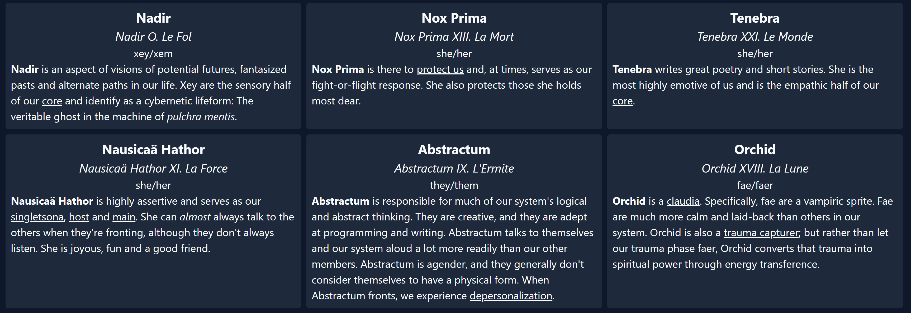

# currently fronting

A web app for displaying a [PluralKit](https://pluralkit.me/) system's current public fronters.

The index automatically redirects to an example page, but folks can find their system or a friend's at `https://front.plural.codes/system-id-here`. Just replace `system-id-here` with the system ID in question. Our page, for example, is available at https://front.plural.codes/menti.

## Query parameters and viewing own private fronters

An interface for configuring query parameters and viewing y'all's own system's private fronters is coming soon&trade;. Until then, below are a list of currently available query parameters for configuring the layout of y'all's link, along with their acceptable values. Any unacceptable value will result in the default being used instead.

- `s`: System
  - `true`: Display a system card at the end of the member list
  - `false` _default_: Do not display a system card
- `a`: Avatar
  - `none`: Do not display avatars
  - `right`: Display avatars to the right of text
  - `center`: Display avatars centered above text
  - `left` _default_: Display avatars to the left of text
- `b`: Banner
  - `none`: Do not display banners
  - `text`: Display banners as backgrounds for all non-description text
  - `bottom`: Display banners below text
  - `top` _default_: Display banners above text

## Query parameter examples

https://front.plural.codes/menti?b=text&a=none: **Banners as backgrounds, no avatars**  

https://front.plural.codes/menti?a=none&b=none: **No banners, no avatars**  

https://front.plural.codes/menti?s=true&b=bottom&a=right: **System card, banners on the bottom, avatars on the right**  

https://front.plural.codes/menti: Default settings (no parameters)  

# Privacy Policy

Requests to the [PluralKit API](https://pluralkit.me/api/) are made client-side, with responses subsequently cached and automatically invalidated when data changes through [SWR](https://swr.vercel.app/). When fronters for a system update, the cache invalidates. Upon the site's return to focus, it updates the page automatically to display the new data. The page also refreshes the cache in the background on an interval, as long as the browser tab remains in focus. This app only accesses publicly available data on fronters.

# Terms of Service

This app is hosted on [Vercel](https://vercel.com/), so we're beholden to their service guarantees. Other than that, the app _shouldn't_ break due to the way Vercel works, unless we bork something on a branch and it somehow makes it to `main`. All that said...

# Bug Reporting

If you encounter an issue with the app, please feel free to file a GitHub issue in this project or mention us (`pulchra mentis#1321`) in the PluralKit Discord server's `#community-resources-help` channel.
